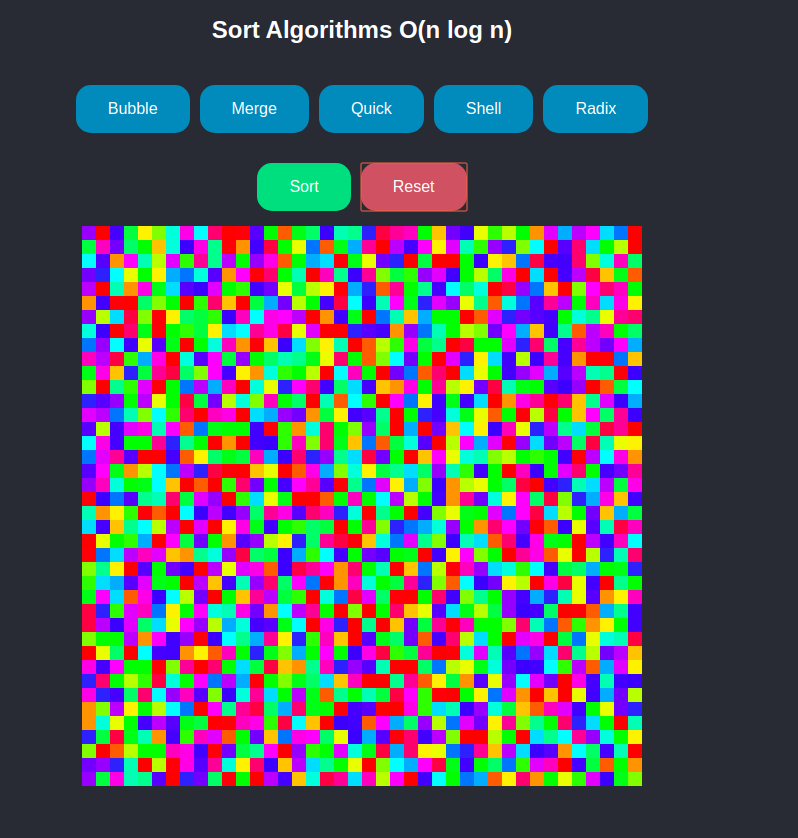
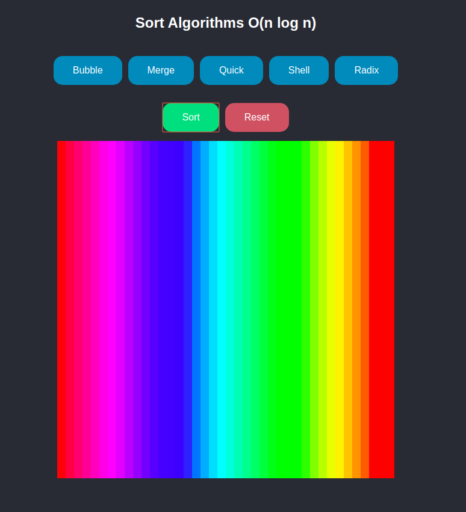

# Repositório Template
Repositório de Template para os projetos da disciplina 

## Alunos  
| Matrícula | Nome |  
|-----------------------|---------------------|  
| 16/0120918 | Gabriel de Jesus Carvalho |   

## Descrição do projeto
O projeto é mostra os algoritmos O(nlogn) em ação, ordenando uma matriz de cores pela propriedade Hue.
## Guia de instalação
Para executar o programa é necessário ter o Node e Yarn instalados.  
- [Instalação do Node](https://nodejs.org/en/download/)
- [Instalação do Yarn](https://yarnpkg.com/lang/en/docs/install/#debian-stable)

### Como executar o projeto
```
yarn install
```
```
yarn start
```
## Capturas de tela



## Referências
 - [Algorithm Playground](https://algorithm-playground.com/)
 - [Hue](https://en.wikipedia.org/wiki/Hue)

